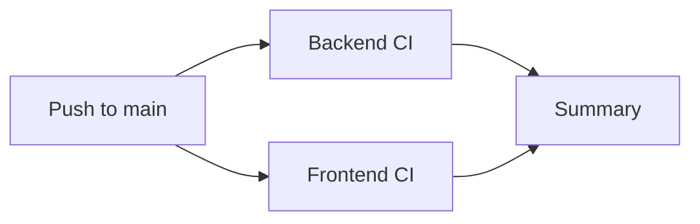
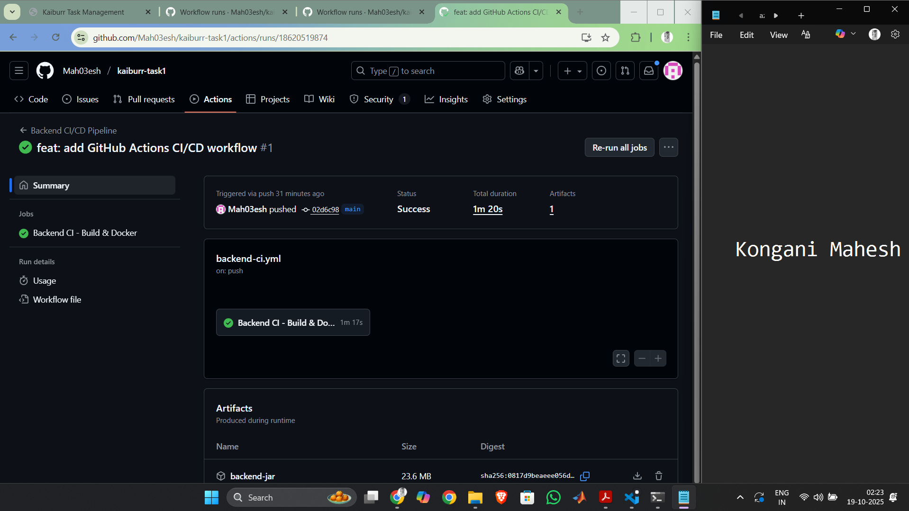
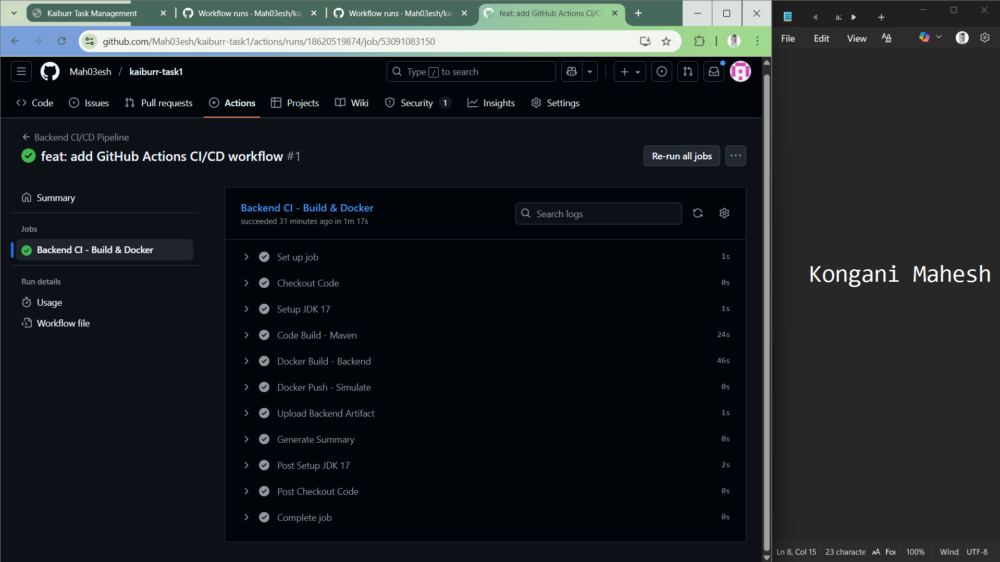
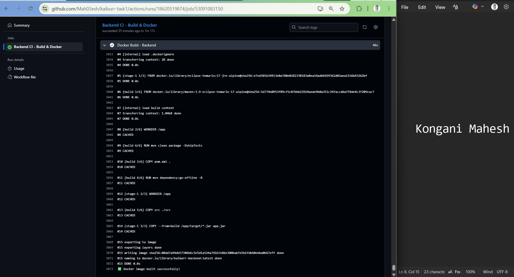
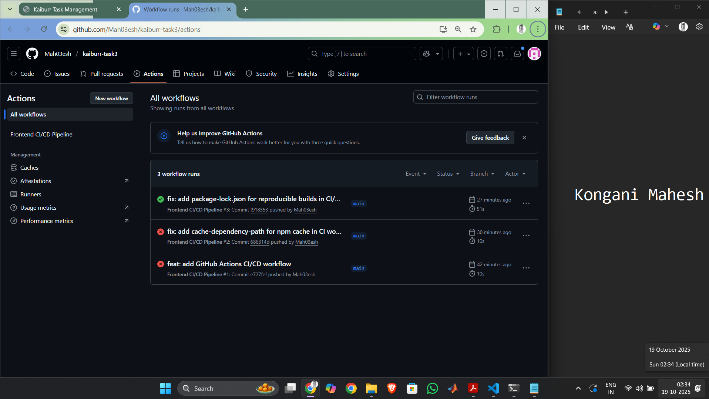
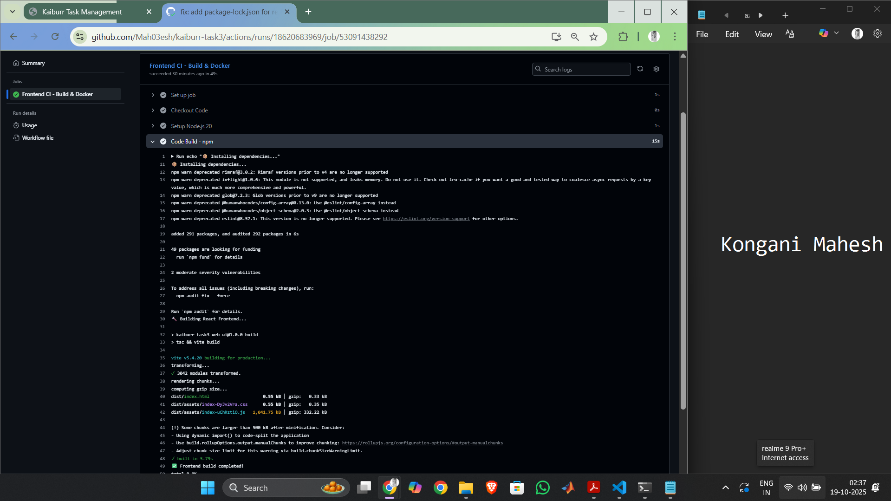
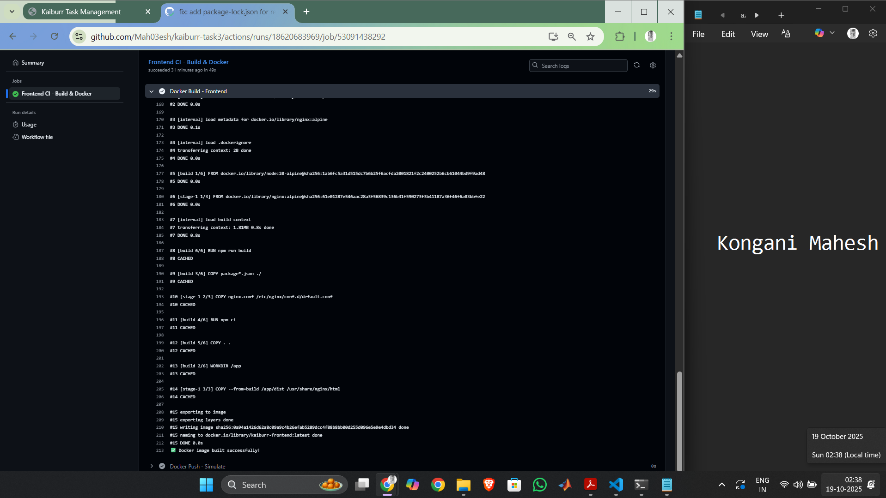

# Task 4: CI/CD Pipeline - Kaiburr Assessment

## Overview

This project implements a **complete CI/CD pipeline** using **GitHub Actions** to automate the build and deployment process for the Kaiburr Task Management Application.

###  Pipeline Objectives

-   Automated build and test for **Java Backend** (Spring Boot)
-   Automated build for **React Frontend** (TypeScript + Ant Design)
-   Multi-stage Docker image creation for both services
-   Parallel execution of Backend and Frontend CI jobs
-   Artifact uploading for build outputs
-   Automatic versioning using GitHub run numbers
-   Pipeline summary and status reporting

---

## Architecture

### Repository Structure

```
task4/
├── .github/
│   └── workflows/
│       └── ci-cd-pipeline.yml      # Main CI/CD workflow
├── screenshots/                     # Pipeline execution screenshots
│   ├── 01_workflow_runs.png
│   ├── 02_workflow_details.png
│   ├── 03_backend_job.png
│   ├── 04_frontend_job.png
│   ├── 05_maven_build.png
│   ├── 06_npm_build.png
│   ├── 07_docker_backend.png
│   ├── 08_docker_frontend.png
│   ├── 09_artifacts.png
│   └── 10_summary.png
├── README.md                        # This file
└── .gitignore                       # Git ignore rules
```

### Related Repositories

- **Backend (Task 1)**: https://github.com/mah03esh/kaiburr-task1
- **Frontend (Task 3)**: https://github.com/mah03esh/kaiburr-task3
- **CI/CD Pipeline (Task 4)**: https://github.com/mah03esh/kaiburr-task4

---

## Pipeline Workflow

### Triggers

The pipeline is triggered by:
- **Push** to `main` branch
- **Pull Requests** to `main` branch
- **Manual dispatch** (via GitHub UI)

### Jobs Overview



#### **Job 1: Backend CI** (runs on ubuntu-latest)

1. **Checkout Code** - Clone repository
2. **Setup JDK 17** - Install Java Development Kit with Maven cache
3. **Code Build - Maven** - `mvn clean package -DskipTests`
4. **Docker Build - Backend** - Multi-stage Docker image creation
5. **Docker Push - Simulate** - Display image tags and registry info
6. **Upload Backend Artifact** - Save JAR file (7-day retention)

#### **Job 2: Frontend CI** (runs on ubuntu-latest)

1. **Checkout Code** - Clone repository
2. **Setup Node.js 20** - Install Node with npm cache
3. **Code Build - npm** - `npm ci && npm run build`
4. **Docker Build - Frontend** - Multi-stage Docker image creation
5. **Docker Push - Simulate** - Display image tags and registry info
6. **Upload Frontend Artifact** - Save built static files (7-day retention)

#### **Job 3: Summary Report** (runs on ubuntu-latest)

- Executes after both Backend and Frontend jobs complete
- Generates comprehensive pipeline summary
- Displays job status, Docker image tags, and metadata

---

## 🐳 Docker Images

### Backend Image (Multi-Stage Build)

**Stage 1: Build**
- Base: `maven:3.9-eclipse-temurin-17-alpine`
- Copies `pom.xml` and source code
- Runs Maven build: `mvn clean package -DskipTests`

**Stage 2: Runtime**
- Base: `eclipse-temurin:17-jre-alpine`
- Minimal JRE-only image
- Copies JAR from build stage
- Exposes port 8080
- Entry point: `java -jar task1.jar`

### Frontend Image (Multi-Stage Build)

**Stage 1: Build**
- Base: `node:20-alpine`
- Installs dependencies: `npm ci`
- Builds production bundle: `npm run build`

**Stage 2: Runtime**
- Base: `nginx:alpine`
- Copies custom nginx configuration
- Copies built static files from build stage
- Exposes port 80
- Serves React SPA with fallback routing

---

##  Image Tagging Strategy

Each successful pipeline run creates **two tags** per image:

1. **Versioned Tag**: `image-name:{run_number}`
   - Example: `kaiburr-backend:42`
   - Tracks specific pipeline executions

2. **Latest Tag**: `image-name:latest`
   - Always points to most recent build

**Full Image Names:**
- `docker.io/mah03esh/kaiburr-backend:{run_number}`
- `docker.io/mah03esh/kaiburr-frontend:{run_number}`

---

## Screenshots

### 1. Backend Workflow Runs Overview

**Capture:** Navigate to Task 1 repository → Actions tab → Show list of backend pipeline runs with status indicators

### 2. Backend Workflow Details

**Capture:** Click on successful backend workflow run → Show job details with execution times and artifacts

### 3. Maven Build Output

**Capture:** Backend CI → Code Build - Maven step → Show Maven compilation and JAR creation logs with BUILD SUCCESS

### 4. Backend Docker Build

**Capture:** Backend CI → Docker Build step → Show multi-stage build completion and image tags

### 5. Backend Artifacts

**Capture:** Backend workflow run → Artifacts section → Show backend-jar artifact with size (23.6 MB)

### 6. Frontend Workflow Runs Overview

**Capture:** Navigate to Task 3 repository → Actions tab → Show list of frontend pipeline runs with status indicators

### 7. Frontend Workflow Details

**Capture:** Click on successful frontend workflow run → Show job details with execution times and artifacts

### 8. npm Build Output

**Capture:** Frontend CI → Code Build - npm step → Show Vite build output with dist/ creation

### 9. Frontend Docker Build

**Capture:** Frontend CI → Docker Build step → Show multi-stage build with Node + Nginx layers

### 10. Frontend Artifacts

**Capture:** Frontend workflow run → Artifacts section → Show frontend-dist artifact

---

## Usage Instructions

### Viewing Pipeline Results

1. Navigate to your GitHub repository
2. Click on the **Actions** tab
3. Select **Kaiburr CI/CD Pipeline** from the workflows list
4. View recent runs and their status
5. Click on any run to see detailed logs

### Triggering the Pipeline

**Automatic Trigger:**
```bash
git add .
git commit -m "feat: update backend API"
git push origin main
```

**Manual Trigger:**
1. Go to Actions tab
2. Select "Kaiburr CI/CD Pipeline"
3. Click "Run workflow"
4. Select branch and click "Run workflow"

### Downloading Artifacts

1. Open a completed workflow run
2. Scroll to "Artifacts" section
3. Download `backend-jar` or `frontend-dist`
4. Artifacts are retained for 7 days

---

## 🧪 Local Testing

### Test Backend Docker Image

```bash
# Navigate to Task 1 directory
cd ../task1

# Build Docker image
docker build -t kaiburr-backend:local .

# Run container
docker run -p 8080:8080 kaiburr-backend:local

# Test endpoint
curl http://localhost:8080/api/tasks
```

### Test Frontend Docker Image

```bash
# Navigate to Task 3 directory
cd ../task3

# Build Docker image
docker build -t kaiburr-frontend:local .

# Run container
docker run -p 3000:80 kaiburr-frontend:local

# Open browser
start http://localhost:3000
```

---

## ⚙️ Configuration Details

### Environment Variables

| Variable | Value | Usage |
|----------|-------|-------|
| `BACKEND_IMAGE` | `kaiburr-backend` | Backend Docker image name |
| `FRONTEND_IMAGE` | `kaiburr-frontend` | Frontend Docker image name |
| `github.run_number` | Auto-incremented | Image version tag |
| `github.repository_owner` | `mah03esh` | Docker registry namespace |

### Workflow Inputs

The workflow uses:
- **JDK 17** (Temurin distribution)
- **Node.js 20** (LTS version)
- **Maven 3.9+** (bundled with setup-java)
- **npm** (bundled with Node.js)
- **Docker Engine** (pre-installed on ubuntu-latest)

### Cache Strategy

- **Maven**: Dependencies cached via `setup-java@v4`
- **npm**: Dependencies cached via `setup-node@v4`
- Caches persist across workflow runs for faster builds

---

## 🛠️ Troubleshooting

### Build Failures

**Maven build fails:**
```bash
# Check Java version
- name: Verify Java
  run: java -version

# Check Maven version
- name: Verify Maven
  run: mvn -version
```

**npm build fails:**
```bash
# Clear npm cache
- name: Clear Cache
  run: npm cache clean --force

# Reinstall dependencies
- name: Fresh Install
  run: rm -rf node_modules && npm install
```

### Docker Build Issues

**Build context too large:**
```bash
# Ensure .dockerignore exists
- node_modules
- target
- .git
```

**Image not found:**
```bash
# List Docker images
docker images

# Verify build completed
docker ps -a
```

### Permission Issues

**Permission denied in workflow:**
```yaml
# Add execute permissions
- name: Make script executable
  run: chmod +x script.sh
```

---

## 📊 Pipeline Metrics

### Typical Execution Times

| Job | Average Duration |
|-----|------------------|
| Backend CI | 2-3 minutes |
| Frontend CI | 1.5-2.5 minutes |
| Summary | < 30 seconds |
| **Total** | **~4-6 minutes** |

### Resource Usage

- **Runners**: 2 concurrent ubuntu-latest instances
- **Storage**: ~100-150MB per workflow run (artifacts)
- **Retention**: Artifacts kept for 7 days

---

## 🎓 Learning Outcomes

This CI/CD pipeline demonstrates:

1.   GitHub Actions workflow creation
2.   Parallel job execution
3.   Multi-stage Docker builds
4.   Caching strategies for faster builds
5.   Artifact management
6.   Automated versioning
7.   Status reporting and summaries

---

## 📚 References

- [GitHub Actions Documentation](https://docs.github.com/en/actions)
- [Docker Multi-Stage Builds](https://docs.docker.com/build/building/multi-stage/)
- [Maven Central Repository](https://mvnrepository.com/)
- [npm Registry](https://www.npmjs.com/)

---

## Author

**Mahesh **
- GitHub: [@mah03esh](https://github.com/mah03esh)
- Repository: [kaiburr-task4](https://github.com/mah03esh/kaiburr-task4)

---

## 📝 License

This project is part of the Kaiburr Assessment and is for educational purposes.


